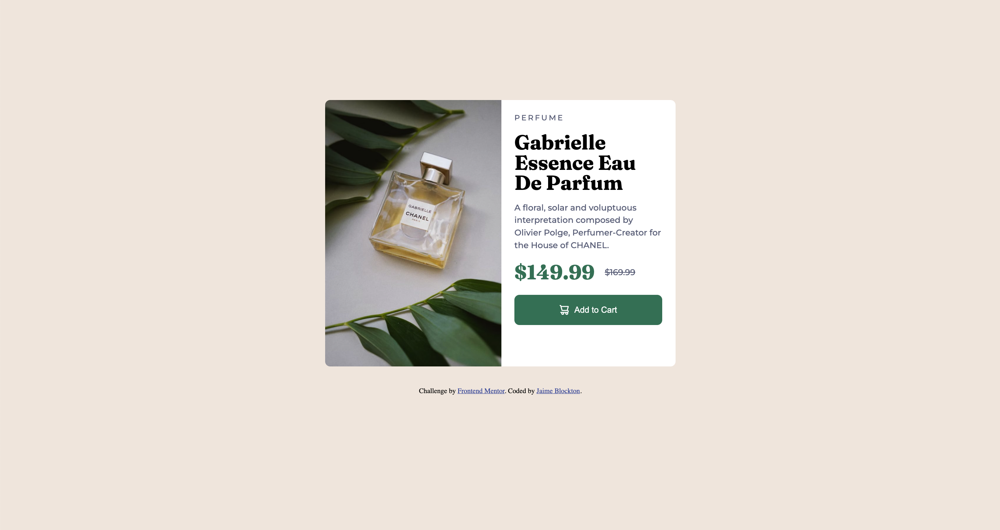
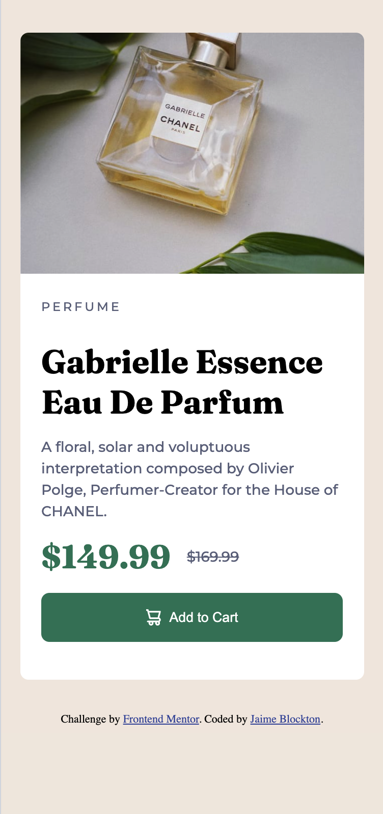

# Frontend Mentor - Product preview card component solution

This is a solution to the [Product preview card component challenge on Frontend Mentor](https://www.frontendmentor.io/challenges/product-preview-card-component-GO7UmttRfa). Frontend Mentor challenges help you improve your coding skills by building realistic projects. 

## Table of contents

- [Overview](#overview)
  - [The challenge](#the-challenge)
  - [Screenshot](#screenshot)
  - [Links](#links)
- [My process](#my-process)
  - [Built with](#built-with)
  - [What I learned](#what-i-learned)
- [Author](#author)

## Overview

### The challenge

Users should be able to:

- View the optimal layout depending on their device's screen size
- See hover and focus states for interactive elements

### Screenshot

### Links

- Solution URL: (https://github.com/digigrrl525/FM-Product-preview-card)
- Live Site URL: (https://digigrrl525.github.io/FM-Product-preview-card)

## My process

I started with the mobile breakpoint and then expanded into the desktop breakpoint.

### Built with

- Semantic HTML5 markup
- CSS custom properties

### What I learned

This was a good refresher on media queries. 

## Author

- Frontend Mentor - [@digigrrl525](https://www.frontendmentor.io/profile/digigrrl525)

